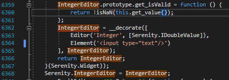

# Editors

## Integer Editor

This Editor is already in place. To upgrade it to a NumericUpDown do the following

In Serenity.CoreLib.js search for IntegerEditor. Find the Element tag and change it:



From:

```markup
<input type="text"/>
```

&#x20;To:

```markup
<input type="number" min="0" max="2000" step="1"/>
```

